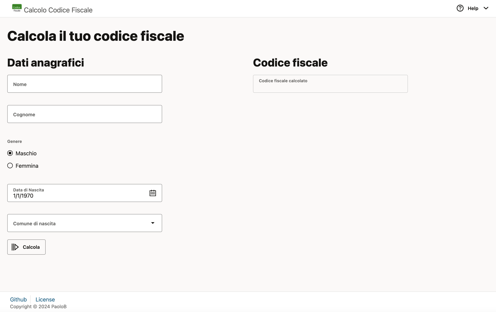

# Calcolo codice fiscale

Una semplice applicazione Javascript per il calcolo del codice fiscale italiano.

L'applicazione si compone di due servizi: un backend che espone una REST API che calcola il codice fiscale a partire da un payload JSON e da un frontend, sviluppato utilizzando il framework [Oracle Jet](https://www.oracle.com/webfolder/technetwork/jet/index.html).

Il payload JSON da utilizzare per invocare la REST API è strutturato come nell'esempio seguente:

```json
{
  "name": "Mario",
  "surname": "Rossi",
  "gender": "M",
  "day": "01",
  "month": "01",
  "year": "1970",
  "town": "ROMA"
}
```

## Utilizzo

### Prerequisiti

- node.js, versione 16 o successive
- Oracle Jet, versione 17 o successive

Per l'installazione e la configurazione dei prerequisiti, fare riferimento alla documentazione dei rispettivi software.

### Esecuzione

Per eseguire e/o modificare l'applicazione [scaricare](https://github.com/paolobellardone/codicefiscale.git) oppure clonare il repository con il seguente comando:

```bash
git clone https://github.com/paolobellardone/codicefiscale.git
```

Nelle rispettive directory, backend e frontend eseguire i seguenti comandi per scaricare i moduli necessari:

backend

```bash
npm install
```

frontend

```bash
ojet restore
```

Per avviare l'applicazione è necessario mettere in esecuzione i due servizi, backend e frontend.

Per eseguire il backend lanciare il comando seguente dalla directory backend:

```bash
node cf.js
```

Il backend si mette in ascolto sulla porta 9000, modificabile mediante la variabile d'ambiente CF_PORT

```bash
CF_PORT=9090 node cf.js
```

Per eseguire il frontend lanciare il comando seguente dalla directory frontend:

```bash
ojet serve web [--release]
```

L'utilizzo del parametro _release_ abilita l'utilizzo di librerie Javascript e CSS minificati.

Oltre che ad essere invocata dal frontend, la REST API può essere invocata direttamente con il seguente comando:

```sh
curl -H "Content-Type: application/json" -X POST -d "{\"nome\": \"Mario\", ...}" http://localhost:9000/cf
```

oppure

```bash
curl -H "Content-Type: application/json" -X POST -d @[payload in json file] http://localhost:9000/cf
```

All'avvio dell'applicazione verrà aperta una finestra del browser predefinito che mostrerà la seguente schermata, nella quale l'utente potrà inserire i propri dati e calcolare il suo codice fiscale.



## License

MIT License

Copyright (c) 2024 PaoloB

Permission is hereby granted, free of charge, to any person obtaining a copy
of this software and associated documentation files (the "Software"), to deal
in the Software without restriction, including without limitation the rights
to use, copy, modify, merge, publish, distribute, sublicense, and/or sell
copies of the Software, and to permit persons to whom the Software is
furnished to do so, subject to the following conditions:

The above copyright notice and this permission notice shall be included in all
copies or substantial portions of the Software.

THE SOFTWARE IS PROVIDED "AS IS", WITHOUT WARRANTY OF ANY KIND, EXPRESS OR
IMPLIED, INCLUDING BUT NOT LIMITED TO THE WARRANTIES OF MERCHANTABILITY,
FITNESS FOR A PARTICULAR PURPOSE AND NONINFRINGEMENT. IN NO EVENT SHALL THE
AUTHORS OR COPYRIGHT HOLDERS BE LIABLE FOR ANY CLAIM, DAMAGES OR OTHER
LIABILITY, WHETHER IN AN ACTION OF CONTRACT, TORT OR OTHERWISE, ARISING FROM,
OUT OF OR IN CONNECTION WITH THE SOFTWARE OR THE USE OR OTHER DEALINGS IN THE
SOFTWARE.
